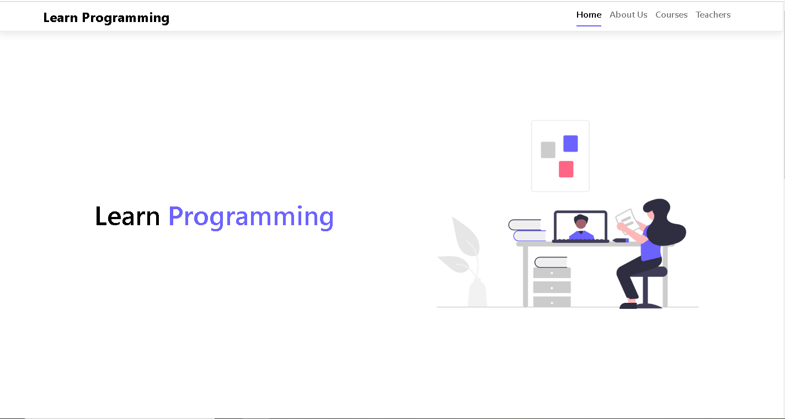
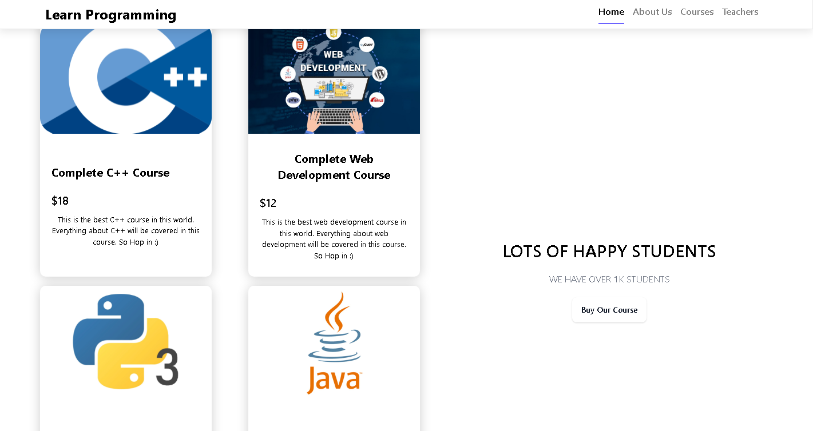
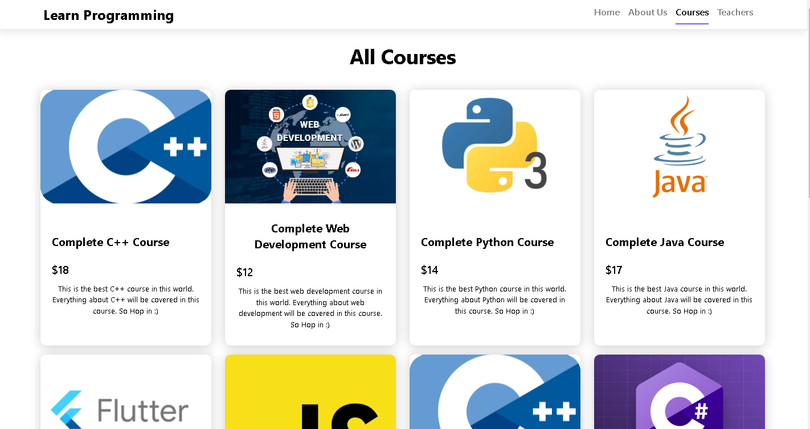
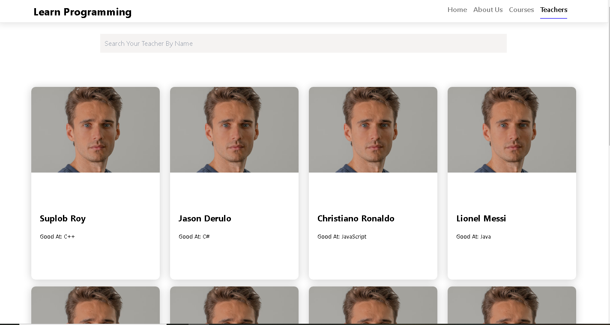

# Learn Programming

Link to [live site](https://learn-programming-suplob.netlify.app/home)

This is a complete responsive modern website made with ReactJS and React Router.









## Technology Stack

- ReactJS
- React Router
- Tailwind CSS

## How to clone this repository

```
    git clone https://github.com/Suplob/learn-programming.git
    cd learn-programming
    npm i
```
